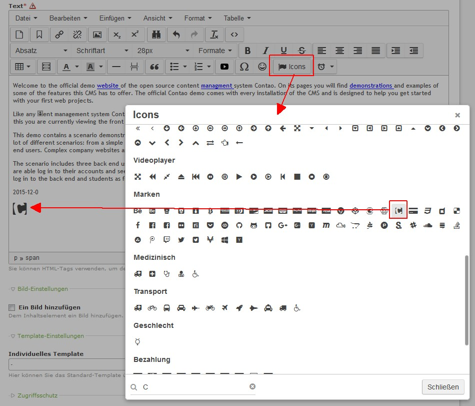

[](https://packagist.org/packages/cliffparnitzky/tiny-mce-font-awesome)
[](https://packagist.org/packages/cliffparnitzky/tiny-mce-font-awesome)
[](https://packagist.org/packages/cliffparnitzky/tiny-mce-font-awesome)

Contao Extension: TinyMceFontAwesome
====================================

Special TinyMCE plugin that that adds a Font Awesome icon selector to the editor.

The sources of this plugin could be found [here](https://github.com/josh18/TinyMCE-FontAwesome-Plugin).

FontAwesome version: 4.7.0
FontAwesome-Plugin version: 2.1.0


Installation
------------

Install the extension via composer: [cliffparnitzky/tiny-mce-font-awesome](https://packagist.org/packages/cliffparnitzky/tiny-mce-font-awesome).

If you prefer to install it manually, download the latest release here: https://github.com/cliffparnitzky/TinyMceFontAwesome/releases


Tracker
-------

https://github.com/cliffparnitzky/TinyMceFontAwesome/issues


Compatibility
-------------

- Contao version >= 3.3.0 ... <  3.6.0
- Contao version >= 4.4.0


Dependency
----------

- To load this plugin and add it to the configuration the extension [[TinyMcePluginLoader]](https://github.com/cliffparnitzky/TinyMcePluginLoader) has to be installed.


Screenshot
----------




Additional information
----------------------

### Special notes

In the backend, the CSS file for the Font Awesome icons will automatically be integrated.

For the frontend, it has to be defined in the themes:


#### Change URL to Font Awesome CSS file

Sometime it will be necessary to change the URL to the Font Awesome CSS file (e.g. in `https` environment).

Add the following line to your `system/config/dcaconfig.php` and modify it (this way is update save):

````
$GLOBALS['TL_FONTAWESOME_CSS'] = 'https://netdna.bootstrapcdn.com/font-awesome/4.4.0/css/font-awesome.min.css';
````

### Information in the wiki

#### Create a new ...

* [Creating a new plugin](https://github.com/cliffparnitzky/TinyMcePluginLoader/wiki/Creating-a-new-plugin)
* [Creating a new bundle](https://github.com/cliffparnitzky/TinyMcePluginLoader/wiki/Creating-a-new-bundle)
* [Creating a new setup](https://github.com/cliffparnitzky/TinyMcePluginLoader/wiki/Creating-a-new-setup)

#### Installation hints
* [Install manually](https://github.com/cliffparnitzky/TinyMcePluginLoader/wiki/Install-manually)

#### Bug report hints

* [Report a bug](https://github.com/cliffparnitzky/TinyMcePluginLoader/wiki/Report-a-bug)